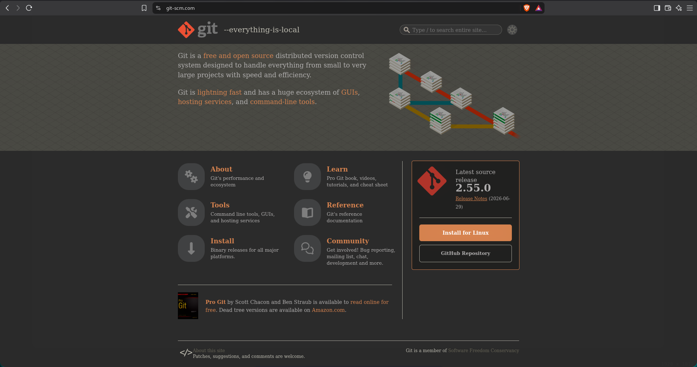
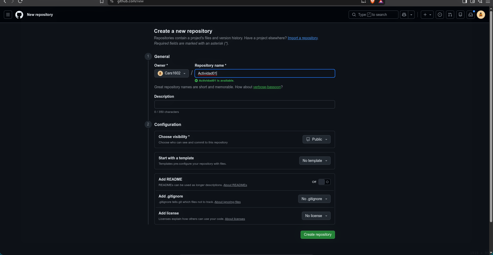
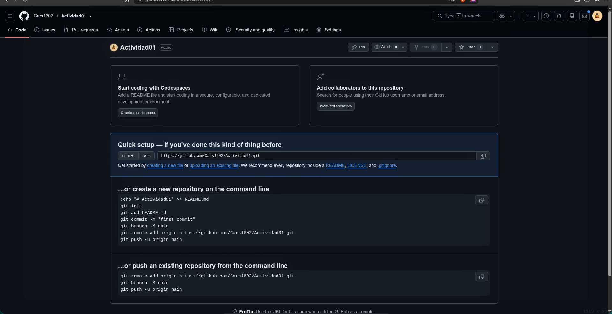
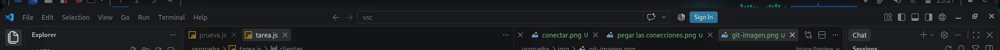
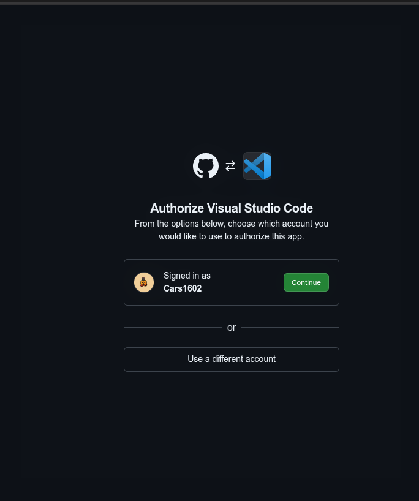
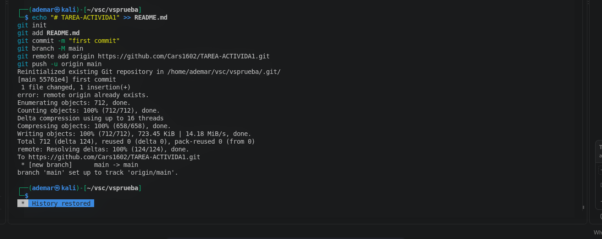
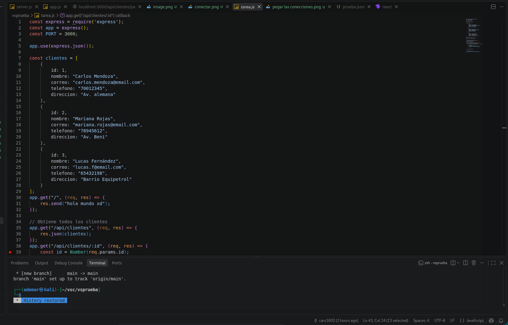
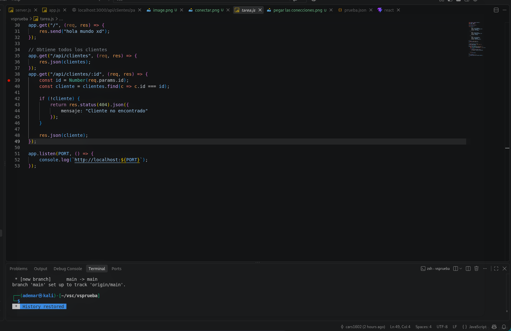

# Actividad 01
## Guía de configuración: Git y GitHub

### 1. Instalación de Git
Descarga e instalación de la herramienta de control de versiones Git en el sistema operativo.

  

### 2. Creación del Repositorio en GitHub
Creación del repositorio remoto `Actividad01` en GitHub con visibilidad pública y sin plantilla inicial.

  

### 3. Instrucciones de Enlace Remoto
Comandos provistos por GitHub para inicializar el repositorio local y vincularlo con el origen remoto.

  

### 4. Autenticación en Visual Studio Code
Inicio de sesión con la cuenta de GitHub directamente desde la interfaz de VS Code.

  

### 5. Autorización de Acceso
Confirmación de permisos y autorización de credenciales para vincular la cuenta de GitHub con el editor.

  

### 6. Inicialización y Push al Repositorio Remoto
Ejecución de los comandos en la terminal integrada para crear la rama `main`, vincular el remoto y subir los archivos mediante `git push`.

  

---

## Explicación del Código (`tarea.js`)

### 1. Inicialización y Datos en Memoria
* **Importación:** Se requiere `express` y se inicializa la aplicación en el puerto `3000`.
* **Middleware:** `app.use(express.json())` habilita el parseo de solicitudes con cuerpo en formato JSON.
* **Estructura de Datos:** Colección de objetos `clientes` en memoria con campos `id`, `nombre`, `correo`, `telefono` y `direccion`.
* **Ruta Base:** Endpoint `GET /` que devuelve una respuesta simple para verificar el funcionamiento del servidor.

  

### 2. Endpoints de Consulta y Arranque del Servidor
* **GET `/api/clientes`:** Devuelve el arreglo completo de clientes en formato JSON con estado HTTP `200 OK`.
* **GET `/api/clientes/:id`:**
  * Extrae el parámetro dinámico `id` y lo convierte a entero (`Number(req.params.id)`).
  * Busca el cliente correspondiente usando el método `.find()`.
  * Si no existe, devuelve estado `404 Not Found` junto a un mensaje de error.
  * Si existe, responde con la información del cliente.
* **`app.listen(PORT)`:** Levanta el servidor Express a la escucha de peticiones en `http://localhost:3000`.

  

---

## Resumen de Rutas

| Método | Ruta | Descripción | Estado de Éxito |
| :--- | :--- | :--- | :--- |
| `GET` | `/` | Comprobación de estado del servidor | `200 OK` |
| `GET` | `/api/clientes` | Obtiene la lista completa de clientes | `200 OK` |
| `GET` | `/api/clientes/:id` | Busca un cliente específico por su ID | `200 OK` / `404 Not Found` |